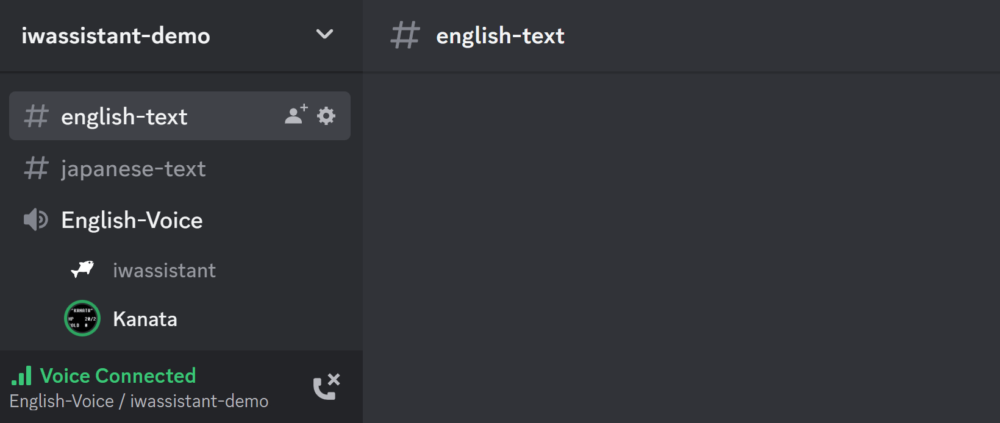
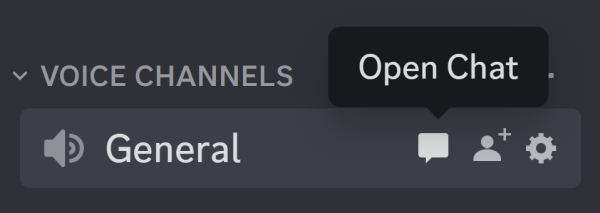
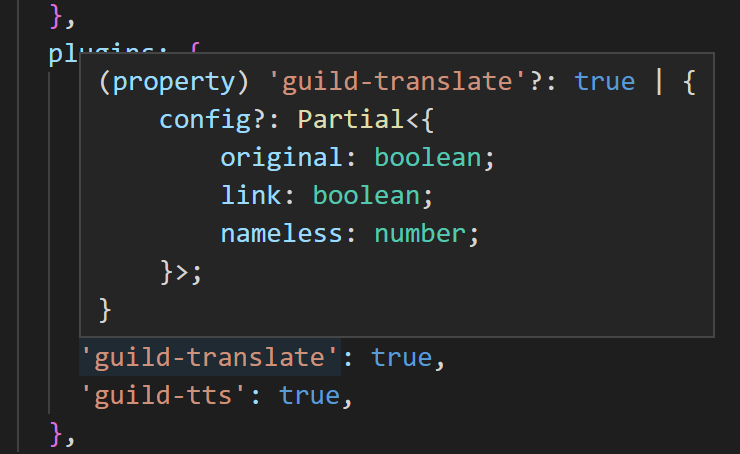
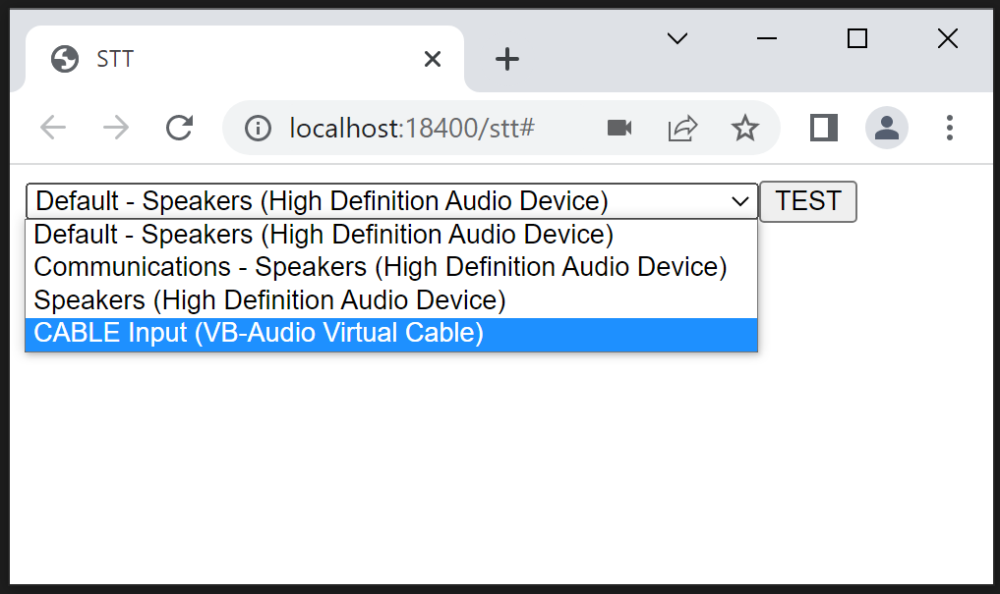
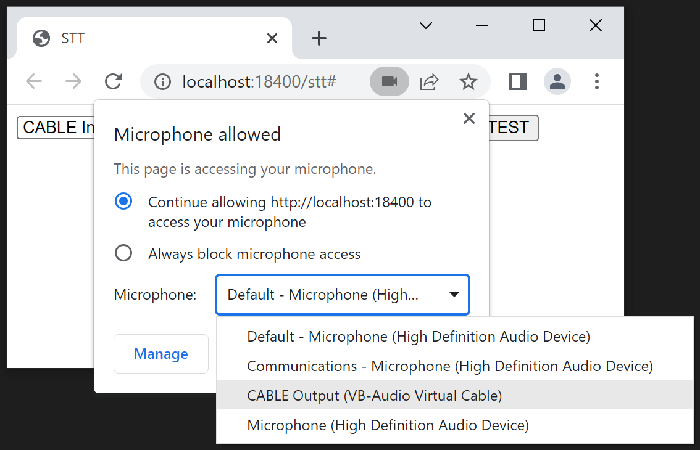

# iwassistant

A Discord bot that speaks, listens, and runs commands, like a smart speaker



## Features

- Text-to-speech 50+ languages
- Speech-to-text 50+ languages
- Translate 100+ languages
- Transcribe and translate in real-time
- Text, slash, and voice commands
- Extensible plugin system

## Requirements

- [Node.js](https://nodejs.org/) v18 or newer

## Preparations

1. [Set up a bot application](https://discordjs.guide/preparations/setting-up-a-bot-application.html)
1. [Enable the **Message Content** and **Server Members** intents in Discord Developer Portal](https://discordpy.readthedocs.io/en/stable/intents.html#privileged-intents)
1. [Add your bot to servers with the invite link below](https://discordjs.guide/preparations/adding-your-bot-to-servers.html)

```
# Replace the client id
https://discord.com/api/oauth2/authorize?client_id=__YOUR_CLIENT_ID__&permissions=3238976&scope=bot%20applications.commands
```

The following, required permissions will be granted automatically. If not, [you have to do it manually](https://support.discord.com/hc/en-us/articles/206029707-Setting-Up-Permissions-FAQ).

- Text Channel
  - **View Channels**
  - **Send Messages**
  - **Embed Links**
  - **Add Reactions**
  - **Manage Messages**
  - **Read Message History**
- Voice Channel
  - **Connect**
  - **Speak**

## Installations

First of all, install packages.

```sh
npm i
```

Second, edit `src/env/default.ts`.

- `locale`: Language code, or region locale code
  - e.g. `en`, `jp`, `zh`, `en-US`, `en-GB`, `zh-TW`, `zh-HK`
  - cf. [Languages.ts](./src/app/locales/Languages.ts), [RegionLocales.ts](./src/app/locales/RegionLocales.ts)
- `discord.token`: Your bot's token
  - Or, comment out the `token` field and set it to [a environment variable as DISCORD_TOKEN](https://discord.js.org/#/docs/discord.js/main/class/Client?scrollTo=token)

Now, `src/env/default.ts` should look like this.

```ts
export const env: Env = {
  locale: 'en',
  discord: {
    token: 'XXXX...',
    ...
```

Then build and launch.

```sh
npm run build
npm start
```

The bot should work perfectly, except for speech-to-text. [It'll be explained later](#setting-up-google-chrome-stt). Let's check out the basic features first.

## Commands

iwassistant accepts commands in three ways.

| Type  | Description                | User Action                                  |
| ----- | -------------------------- | -------------------------------------------- |
| Slash | Modern Discord bot style   | Input `/help` in a text channel              |
| Text  | Smart speaker-ish style    | Input "OK assistant, help" in a text channel |
| Voice | Actual smart speaker style | Say "OK assistant, help" in a voice channel  |

After the `/help` command, you'd see some commands you can use in your server. Those commands are provided by plugins.

## Plugins

iwassistant itself doesn't have any feature, its plugins have. The following plugins are builtin.

<table>
  <tr>
    <th>Name</th>
    <th>Command</th>
    <th>Description</th>
  </tr>
  <tr>
    <td>guild-announce</td>
    <td>-</td>
    <td>Announcements in a voice channel</td>
  </tr>
  <tr>
    <td rowspan="3">guild-config</td>
    <td><code>/config-server</code></td>
    <td>Configure server's settings</td>
  </tr>
  <tr>
    <td><code>/config-user</code></td>
    <td>Configure user's settings</td>
  </tr>
  <tr>
    <td><code>/config-channel</code></td>
    <td>Configure text and <strong>voice*</strong> channel's settings</td>
  </tr>
  <tr>
    <td>guild-follow</td>
    <td>-</td>
    <td>Auto-join to a voice channel</td>
  </tr>
  <tr>
    <td>guild-help</td>
    <td><code>/help</code></td>
    <td>List all the available commands</td>
  </tr>
  <tr>
    <td>guild-notify</td>
    <td>-</td>
    <td>Notify message reactions via DM</td>
  </tr>
  <tr>
    <td>guild-react</td>
    <td>-</td>
    <td>Auto-response to text messages</td>
  </tr>
  <tr>
    <td>guild-stt</td>
    <td>-</td>
    <td>Speech-to-text features</td>
  </tr>
  <tr>
    <td rowspan="2">guild-summon</td>
    <td><code>/join</code></td>
    <td>Join to a voice channel</td>
  </tr>
  <tr>
    <td><code>/leave</code></td>
    <td>Leave from a voice channel</td>
  </tr>
 <tr>
    <td>guild-translate</td>
    <td>-</td>
    <td>Translation features</td>
  </tr>
  <tr>
    <td>guild-tts</td>
    <td>-</td>
    <td>Text-to-speech features</td>
  </tr>
</table>

<strong>\*</strong> Input the command in <a href="https://support.discord.com/hc/en-us/articles/4412085582359-Text-Channels-Text-Chat-In-Voice-Channels#h_01FMJT412WBX1MR4HDYNR8E95X">a text chat in a voice channel</a>



### Plugin Customizations

You can enable/disable/customize the plugins and build your own assistant by editing `src/env/default.ts`. When you mouse over a plugin name in [Visual Studio Code](https://code.visualstudio.com/), the pop-up window tells what properties the plugin has. Or, you can just jump to the definition by the F12 key.



There are three types of plugin properties. `config`, `permissions`, and `i18n`. Here are examples.

```ts
    'guild-translate': {
      config :{
        // hide original text in translation
        original: false,
      }
    },
```

```ts
    'guild-help': {
      permissions: {
        // restrict command
        help: ['SendMessages'],
      }
    },
```

```ts
    'guild-announce': {
      i18n: {
        // add Korean dictionary
        ko: {
          dict: {
            join: ['안녕하세요, ${name}님', '환영합니다, ${name}님'],
            stream: ['손님 여러분, ${name}님이 스트리밍을 시작했습니다'],
          },
        },
      }
    },
```

```ts
    'guild-help': {
      i18n: {
        // add Korean command
        ko: {
          command: {
            help: {
              description: '도움말 보기',
              example: '도움말',
              patterns: ['도움말'], // RegExp format
            },
          },
        },
      }
    },
```

The builtin plugins only support English, Japanese, Simplified Chinese, and Traditional Chinese. If you add a new command language to your settings, you must also add an activation word to the `assistant` property.

```ts
  assistant: {
    activation: {
      word: {
        ko: {
          example: 'OK 어시스턴트, ',
          patterns: ['어시스턴트'], // RegExp format
        },
      }
    }
  },
```

Your `i18n` settings will be merged with the default settings but the activation word settings will not. For example, when you add `ko` and still want to have `en` and `ja`, you have to copy and paste the `en` and `ja` settings from [the default settings](./src/app/classes/Assistant.ts).

### Voice Activation

By default, voice commands are only available when dictating. If you want to make them available at all times, here is the solution.

```ts
    'guild-stt': {
      config: {
        command: true,
      },
    },
```

With this setting, the `guild-stt` plugin always transcribes every speech to activate and parse commands, which means that a speech-to-text engine consumes its resources for several seconds every time. When you use the Google Cloud speech-to-text engine, and want to save your money, be careful with this setting.

## Engines

iwassistant has four types of engines, `store`, `translator`, `tts`, and `stt`. The following engines are builtin.

| Name                        | Description                     | Free |
| --------------------------- | ------------------------------- | ---- |
| store-local                 | Local JSON store                | ✔️   |
| store-firestore             | Google Cloud Firestore          |      |
| translator-google-translate | Google Translate translator     | ✔️   |
| translator-google-cloud     | Google Cloud Translation        |      |
| tts-google-translate        | Google Translate text-to-speech | ✔️   |
| tts-google-cloud            | Google Cloud text-to-speech     |      |
| stt-google-chrome           | Google Chrome speech-to-text    | ✔️   |
| stt-google-cloud            | Google Cloud speech-to-text     |      |

### Engine Customizations

Like the plugins, the engines are customizable and switchable by `src/env/default.ts`. Here is an example.

```ts
  engines: {
    'store-local': {
      // move the data directory from `tmp/store/1/` to `tmp/store/2/`
      id: '2',
    },
    'stt-google-chrome': {
      // change the executable path of Google Chrome
      exec: '/home/kanata/apps/google/chrome',
    },
  },
```

### Google Cloud Engines

The free engines are very basic or unreliable. For example, if you use the `tts-google-translate` engine thousands of times in a few minutes, you might get banned from the API for a while. If you want to make your bot more reliable, use the Google Cloud engines instead. They are not free, but thankfully, they have free quotas. [Firestore](https://cloud.google.com/firestore/pricing), [Cloud Translation](https://cloud.google.com/translate/pricing), and [Cloud Text-to-Speech](https://cloud.google.com/text-to-speech/pricing) will probably not charge you if your bot is private. However, the free quota of [Cloud Speech-to-Text](https://cloud.google.com/speech-to-text/pricing) is only one hour per month. Be careful with your settings and be aware of what you're doing. Here is the setup procedure.

1. [Create a project and select it](https://console.cloud.google.com/cloud-resource-manager)
1. Setup APIs
   - Firestore: [Create a Firestore in Native mode database](https://console.cloud.google.com/firestore/data) (cf. [Guide](https://cloud.google.com/firestore/docs/create-database-server-client-library#create_a_in_native_mode_database))
   - Cloud Translation: [Enable the API](https://console.cloud.google.com/flows/enableapi?apiid=translate.googleapis.com)
   - Cloud Text-to-Speech: [Enable the API](https://console.cloud.google.com/flows/enableapi?apiid=texttospeech.googleapis.com)
   - Cloud Speech-to-Text: [Enable the API](https://console.cloud.google.com/flows/enableapi?apiid=speech.googleapis.com)
1. [Create a service account and get a JSON file](https://console.cloud.google.com/projectselector2/iam-admin/serviceaccounts/create)
   1. Select your project
   1. Input a service account name as you want
   1. `CREATE AND CONTINUE`
   1. Set the role as `owner`
   1. `DONE`
   1. Select the account you've just created
   1. Go to the `KEYS` tab
   1. `ADD KEY` and `Create new key`
   1. `CREATE`
1. Save the JSON file as `secrets/google-cloud.json`
1. Edit `src/env/default.ts` as follows, then build and launch

```ts
  engines: {
    'store-firestore': true,
    'translator-google-cloud': true,
    'tts-google-cloud': true,
    'stt-google-cloud': true,
  },
```

### Setting Up Google Chrome STT

The `stt-google-chrome` engine is disabled by default because the setup procedure is complicated. It takes some time but it's something you have to do if you want to use a free speech-to-text engine.

First of all, enable the engine in `src/env/default.ts`.

```ts
    'stt-google-chrome': true,
```

Note: The setup procedure for Ubuntu Server will be explained [later](#ubuntu-server).

#### Windows/Mac/Ubuntu Desktop

Second, install the requirements.

- [Google Chrome](https://www.google.com/chrome/)
- Virtual audio device
  - Windows/Mac: [VB-CABLE Virtual Audio Device](https://vb-audio.com/Cable/)
  - Ubuntu: [PulseAudio](https://www.freedesktop.org/wiki/Software/PulseAudio/) (How to add devices is the same as [Ubuntu Server](#ubuntu-server))

Then build and launch. Google Chrome should start automatically. Oh, don't worry. The Chrome user profile is completely isolated. It won't mess up your main profile. The iwassistant user profile is stored in `tmp/chrome/`. If you want to reset the Chrome settings, just delete the directory.

Okay, back to the procedure.

1. Join a voice channel
1. Summon the bot with the `/join` command if the bot doesn't follow you
1. Say something in the voice channel

You would hear your voice on your machine since the Chrome playback device is the default audio device. Let's change it to the virtual playback device.



And change the microphone device as well.



Say "OK assistant, help" in the voice channel. The bot should run the `/help` command. If not, something went wrong with your settings. Check your operating system's volume mixer. Does it react when you speak in the voice channel? Launching in debug mode `npm run debug` also helps you understand what's going on inside.

With the proper settings, the logs should look like this.

```
[INF] [APP] Launching iwassistant
[INF] [APP] Locale: en
[INF] [STT] [Chrome:18400] Output Device: {0.0.1.00000000}.{xxxxxxxx-xxxx-xxxx-xxxx-xxxxxxxxxxxx}
[INF] [STT] [Chrome:18400] Input Devices:
[INF] [STT] - Default - Speakers (High Definition Audio Device)
[INF] [STT] - Communications - Speakers (High Definition Audio Device)
[INF] [STT] - Speakers (High Definition Audio Device)
[INF] [STT] * CABLE Input (VB-Audio Virtual Cable)
```

As noted before, the user profile, including the audio device settings, is stored in `tmp/chrome/`. It's gone when you delete the directory. If you want to make it permanent, you can set it in `src/env/default.ts` beforehand.

```ts
    'stt-google-chrome': {
      instances: [
        {
          port: 18_400,
          input: 'CABLE Input (VB-Audio Virtual Cable)',
          output: '{0.0.1.00000000}.{xxxxxxxx-xxxx-xxxx-xxxx-xxxxxxxxxxxx}',
        },
      ],
    },
```

Note: The settings are the _default_ audio devices. They will be overwritten by a user profile.

Also, you can run multiple instances of Chrome. If your machine has three pairs of virtual audio devices, it can run three Chrome speech-to-text engines simultaneously, which means that the engines can transcribe three user speeches simultaneously.

Here is an example of a Windows machine that has [VoiceMeeter Potato](https://vb-audio.com/Voicemeeter/potato.htm).

```ts
    'stt-google-chrome': {
      instances: [
        {
          port: 18_400,
          input: 'VoiceMeeter Input (VB-Audio VoiceMeeter VAIO)',
          output: '{0.0.1.00000000}.{xxxxxxxx-xxxx-xxxx-xxxx-xxxxxxxxxxxx}',
        },
        {
          port: 18_401,
          input: 'VoiceMeeter Aux Input (VB-Audio VoiceMeeter AUX VAIO)',
          output: '{0.0.1.00000000}.{yyyyyyyy-yyyy-yyyy-yyyy-yyyyyyyyyyyy}',
        },
        {
          port: 18_402,
          input: 'VoiceMeeter VAIO3 Input (VB-Audio VoiceMeeter VAIO3)',
          output: '{0.0.1.00000000}.{zzzzzzzz-zzzz-zzzz-zzzz-zzzzzzzzzzzz}',
        },
      ],
    },
```

#### Ubuntu Server

Here is the setup procedure for Ubuntu Server 22.04.

```sh
# Become a root user
sudo -i

# Prepare to install Google Chrome
curl -fsSL https://dl-ssl.google.com/linux/linux_signing_key.pub | gpg --dearmor -o /etc/apt/trusted.gpg.d/google.gpg
sh -c 'echo "deb http://dl.google.com/linux/chrome/deb/ stable main" >> /etc/apt/sources.list.d/google-chrome.list'

# Install the packages
apt update
apt install -y xvfb pulseaudio google-chrome-stable

# Return to a user
exit

# Setup virtual audio devices
mkdir -p ~/.config/pulse/
cp /etc/pulse/default.pa ~/.config/pulse/
cat <<EOF >> ~/.config/pulse/default.pa
load-module module-null-sink sink_name="v-input-1" sink_properties=device.description="v-input-1"
load-module module-remap-source master="v-input-1.monitor" source_name="v-output-1" source_properties=device.description="v-output-1"
load-module module-null-sink sink_name="v-input-2" sink_properties=device.description="v-input-2"
load-module module-remap-source master="v-input-2.monitor" source_name="v-output-2" source_properties=device.description="v-output-2"
EOF

# Restart PulseAudio
systemctl --user restart pulseaudio
```

Edit `src/env/default.ts` as follows.

```ts
    'stt-google-chrome': {
      instances: [
        {
          port: 18_400,
          input: 'v-input-1',
          output: 'v-output-1',
        },
        {
          port: 18_401,
          input: 'v-input-2',
          output: 'v-output-2',
        },
      ],
    },
```

Then build and launch. It should work perfectly.

```sh
npm run build
xvfb-run -n 0 -s "-screen 0 1x1x8" npm start
```

To make it as a service, create a unit file as `/etc/systemd/system/iwassistant.service`.

```
[Unit]
Description=iwassistant
After=network-online.target multi-user.target graphical.target

[Service]
ExecStart=/bin/bash -c 'sleep 5 && pulseaudio -D && xvfb-run -n 0 -s "-screen 0 1x1x8" node ./dist/app'
WorkingDirectory=/home/kanata/iwassistant
User=kanata
Group=kanata
Restart=always
KillSignal=SIGINT

[Install]
WantedBy=multi-user.target
```

Note: Replace `kanata` with your username

Enable and start the service.

```sh
sudo systemctl enable iwassistant
sudo systemctl start iwassistant
systemctl status iwassistant
```

After that, iwassistant starts automatically when your machine reboots.

Tips: Show the logs

```sh
journalctl -u iwassistant -f
```

## Advanced Usages

### Multi-Environments

1. Copy `examples/env/default.ts` as `src/env/my-alt-env.ts`
1. Edit `src/env/my-alt-env.ts` as you want
1. Build and launch with an env option

```sh
npm run build
npm start -- --env my-alt-env
```

### Multi-Engines

To be written

### Multi-Clients

Note: This is not about sharding, it's about multiple clients in one Discord server.

To be written

## Development

```sh
# Launch without build
npm run dev

# Launch with debug logs without build
npm run debug

# Auto-restart
nodemon --watch './src/**' --signal SIGINT ./src/app/index.ts
```

### User Plugin Example

1. Copy `examples/user/plugins/iwassistant-plugin-guild-echo` as `src/user/plugins/iwassistant-plugin-guild-echo`
1. Add `'guild-echo': true` to your env

### User Engine Example

1. Copy `examples/user/engines/iwassistant-engine-tts-notifier` as `src/user/engines/iwassistant-engine-tts-notifier`
1. Add `'tts-notifier': true` to your env

## TODO

- More detailed examples
- More test codes
- Music player plugin
  - "OK assistant, play some music" in a Discord voice channel would be cool
- Home assistant
  - Migration from [Kanata 2nd Voice Bot](https://github.com/knt2nd/knt2-vbot)

## License

[MIT](./LICENSE)

## Author

Name: Kanata  
Language: Japanese(native) English(intermediate) Chinese(basic)  
Discord: Kanata#3360  
GitHub: https://github.com/knt2nd
